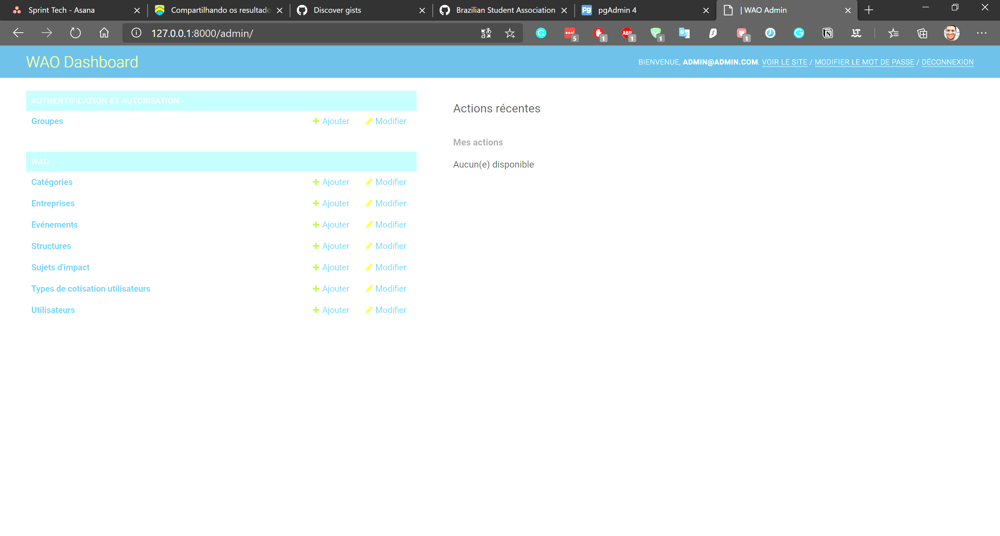

# Comment utiliser le site d'administrateur (admin)

Pour utiliser le site, il suffit d'aller dans ``/admin``.

# Vous allez avoir une interface graphique

Dans l'interface, vous avez possibilité de modifier les données dans la base de donnée d'une façon beaucoup plus simple.

On vous invite à jouer avec la page, c'est vraiment simple et on espère que vous allez aimer modifier vos pages.

