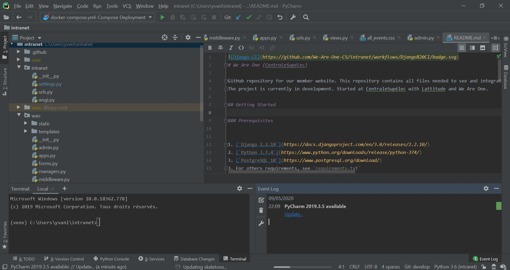
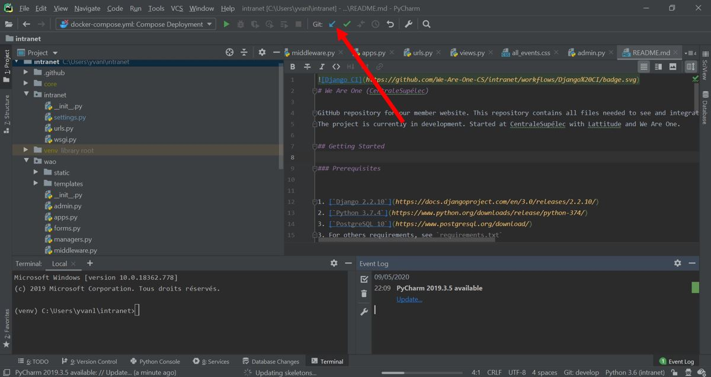
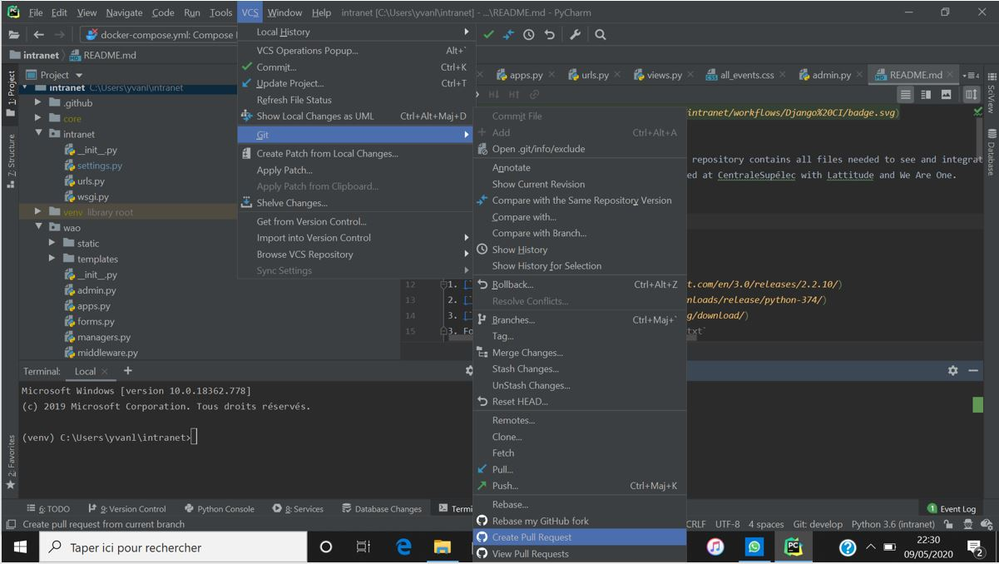

Les différentes versions des logiciels utilisés pour le codage de l'application WAO intranet ont été renseignées dans la rubrique `informations globales`

### Mise en commun du travail des développeurs

La mise en commun est faite sur [`GitHub`](https://github.com/) dans le projet nommé We-Are-One-CS.
GitHub est un outil très pratique pour la mise en commun du travail de différents développeurs.
Pour prendre en main GitHub et pour comprendre son fonctionnement, n'hésitez pas à aller voir les différents [guides GitHub](https://guides.github.com/) disponibles en ligne.

### Coder en local

GitHub sert uniquement à la mise en commun du code, ce dernier devra être fait en local. 
Pour ce faire, il est conseillé d'utiliser [`PyCharm Pro`](https://www.jetbrains.com/fr-fr/pycharm/download/#section=windows) qui est une IDE Python très fonctionnelle, ergonomique et pratique; surtout lorsqu'on travail avec GitHub.
Pour prendre en main PyCharm vous pouvez allez visiter la [documentation dédiée](https://www.jetbrains.com/fr-fr/pycharm/documentation/)

Voici à quoi ressemble le projet sur ``PyCharm Pro``:

Vous pouvez ``update le projet`` simplement en cliquant sur ce bouton:

Et effectuer une ``pull request`` en allant dans ``VCS/Git/Pull Request``:

